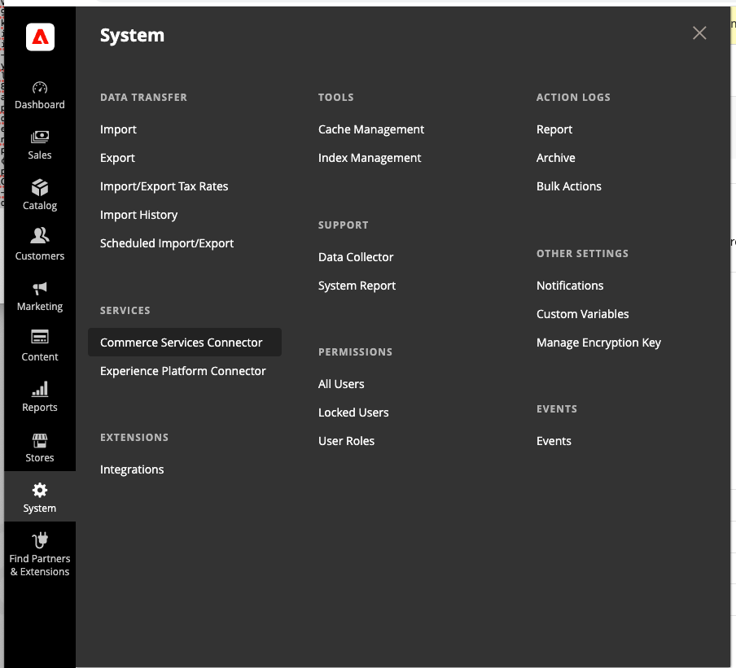
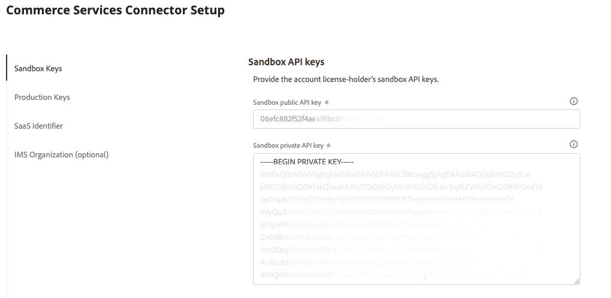
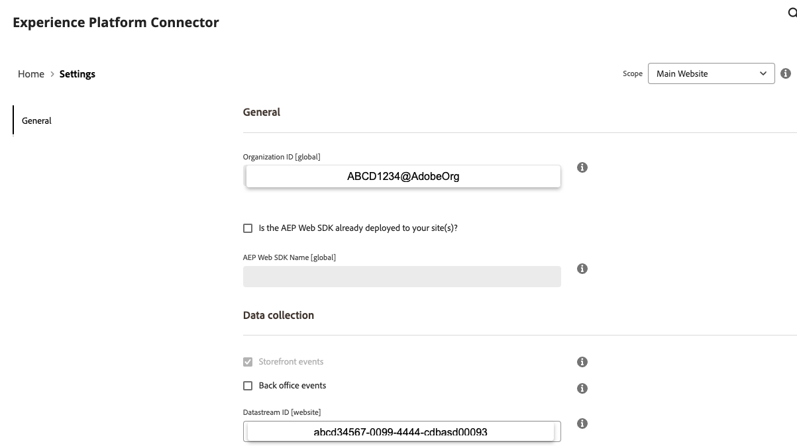
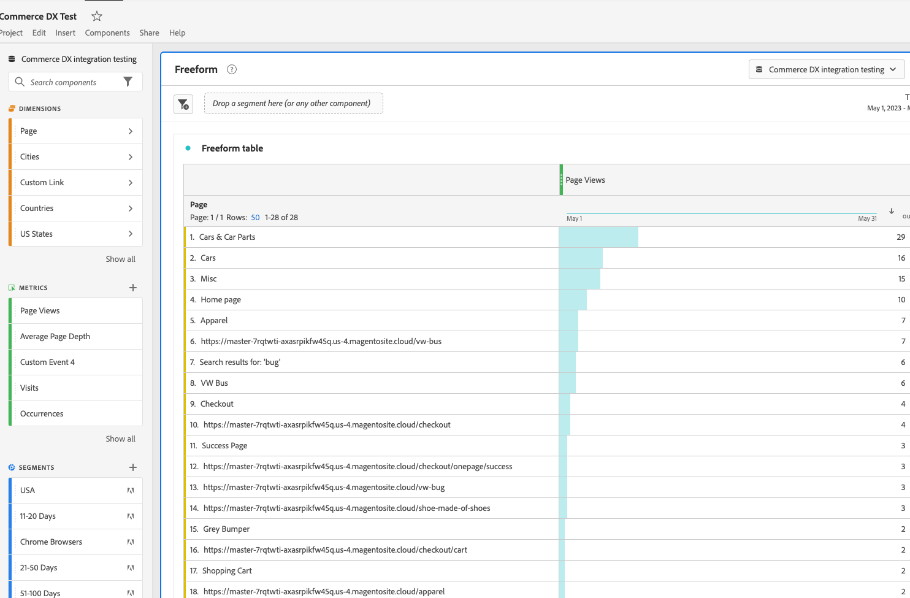

# Integrate Analytics with Commerce

## Initial Onboarding

These instructions are for Adobe Commerce Cloud hosted projects. Self-hosted can vary to some degree, but the overall process should be similar.

Check out the code in your local environment
Use composer and install module
Follow the individual instructions here and return when completed to finish the remaining steps
[Install and configure the Experience Platform connector](https://experienceleague.adobe.com/docs/commerce-merchant-services/experience-platform-connector/fundamentals/install.html){target="_blank"}

Commit the composer.json and if on cloud, composer.lock files
Verify that module is on the staging and/or production environments 
You can do this by logging into the admin section of Adobe Commerce and looking for these new sections under System > Services

Configure the module with your credentials from inside the Adobe Commerce back office.
First the Commerce Services connector configurations

Then the Experience Platform connector settings

For greater details on each phase and step of the onboarding process, follow the instructions on the [Experience Platform connector overview](https://experienceleague.adobe.com/docs/commerce-merchant-services/experience-platform-connector/overview.html){target="_blank"}. The Experience Platform connector tutorial covers each section in depth and answer any questions you may have. Use this tutorial for the rest of the quick setup steps.

## Configuration of Adobe Analytics

* Verify that the account has access to Adobe Analytics.  

* Create a project in Adobe Analytics.

* Create a schema.  
    * You need this to select from the options in later steps. To create a schema, Look in the left column under "Data Management" and find Schemas. Now on the top left, click "Create schema". Select XDM ExperienceEvent.
    * On the left find Field groups, click Add
        * In the search, you can filter by entering `ExperienceEvent Commerce`
        * Look for `Adobe Analytics ExperienceEvent Commerce` and check the box
        * Be sure to click the `Add field groups` on the top right to save and continue
* Create a dataset, you need this when your setup the "DataStream" next.
    * Dataset is found under the left column "Data Management" and looking for "Datasets".  
    * Then click "Create Dataset" found in the top right. You create the dataset from the schema.  
    * search and use the schema that you created earlier
* Create Datastream. You can get to it by using the "Data Collection in the left column" and looking for "Datastreams".
* Create tables with panels and segments. This is way to be complicated for this tutorial, you need an experienced Analytics person to assist.

Finally to view your report, you navigate to experience.adobe.com find your workspace project, click the link of the project you wish to view and you should see something like this image

